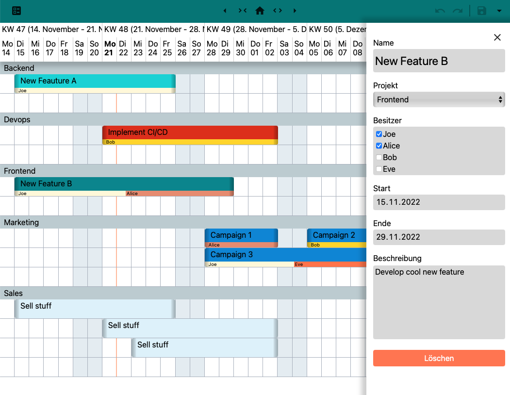

# Gannt chart planning



## Install

`npm i`

## Build / run

`npm run start` | `npm run build`

`node server`

### .env File

Es wird zur Laufzeit die Date `.env` ausgelesen, falls vorhanden, in welcher
der von der Anwendung zu nutzende Port wie folgt konfiguriert werden kann:

```
PORT=8080
```

## Data

Folgende Dateien müssen manuell angelegt und konfiguriert werden.

### `data/users.json` / `data/projects.json`

[
  {
    "id": string,
    "name": string,
    "color": string
  },
  …
]
